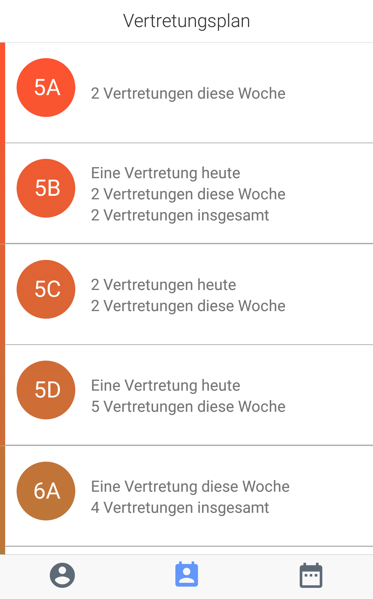
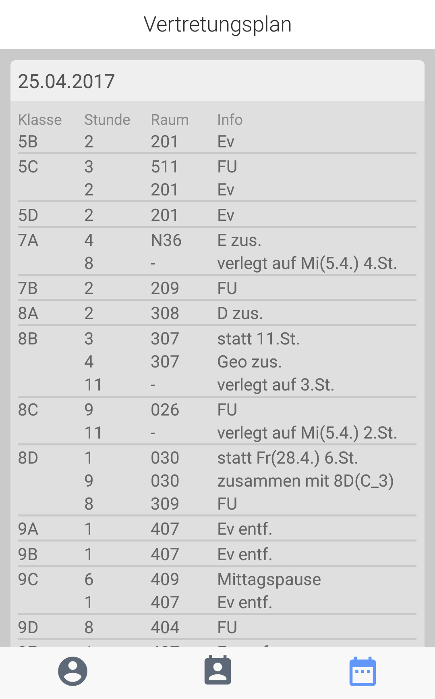
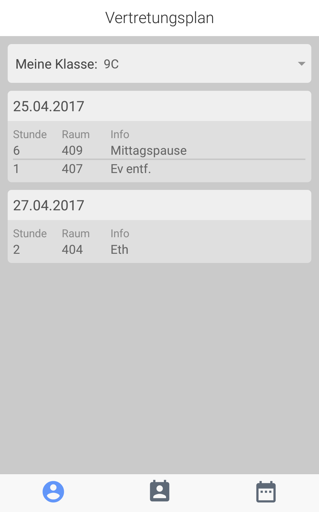

# Vertretungsplan App - Created with React-Native

Die App stellt den  [Vertretungsplan](https://dhg.ssl-secured-server.de/DHG/vplan/vplan.php) in einer nativen App dar und erlaubt das Filtern nacht Klassen und Datum.

##Screenshots

| ClassView | DateView | SubView |
| --- | --- | --- |
|  |  |  |

## Wie du die App installierst
Du kannst die App auf folgenden Wegen installieren:
- **[Play Store](https://play.google.com/store/apps/details?id=com.dotcookie.vertretungsplan)**: Hier findest du die App im Play Store
- **[App Store](https://www.apple.com/de/)**: Zur Zeit ist leider keine IOS-Version verfügbar, ist jedoch in Planung.
- **[React-Native](https://facebook.github.io/react-native/)**: Du kannst das Repository klonen und die App selbst mit React-Native builden.

Ich hoffe die App ist nützlich.
Ich freue mich jeder zeit über Feedback

*Simon*